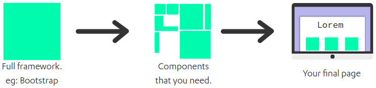

<h1 align="center">
	
</h1>

## Problem
I was working on a project using the bootstrap when I needed to style a progress bar. I created a new file and rewrote the entire bootstrap style for my new progress bar. Then I thought, what if I could copy the progress of the bootstrap quickly and use the styling source for me. Then the gPeto emerged, continue reading to learn more.

## Introduction


You most often don't use all the components that a framework or tool contains.

With gPeto, you can install only what you'll need or install it on demand.

## Getting started

### Installation
```shell
npm install -g gpeto
```

### Add a project for gPeto
With gpeto's command in your terminal , the first thing that you need to do is download the project wich you'll modularize (in this example we'll use Bootstrap).

```shell
bower install Bootstrap

cd bower_components
```

We'll add the Bootstrap to our gpeto folder.

```
gpeto add bootstrap
# [gpeto] ➜ Copied bootstrap successifuly! ⌚ 96 ms
```

### Installing a component in your project
You can go to the project what you're working on and install only the components you need.

```
gpeto install bootstrap/less/progress.less
# [gpeto] ➜ Copied bootstrap/less/progress.less to gpeto_components ⌚ 53 ms
```

If you don't specify a folder with the `--out` flag, all components will be installed in bower_components folder.

## Caution
gPeto doesn't install dependencies automatically yet, but I'm working on some way of doing that. 

## Contribute
Your contributions and suggestions are :heart: welcome.

## Todo
- [ ] Add `remove` and `uninstall` commands
- [ ] Install dependencies automatically

## License
[MIT](LICENSE.md) © Filipe Linhares
